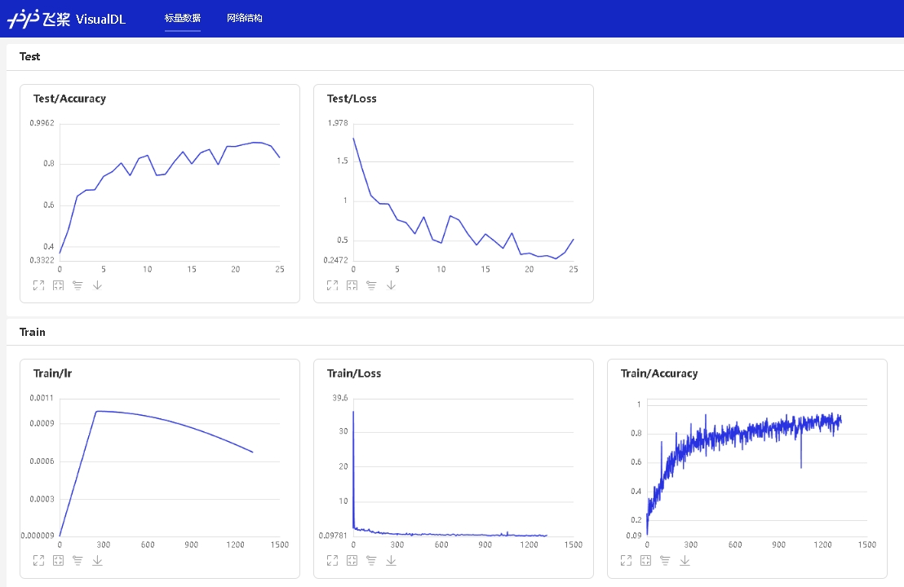

简体中文 | [English](./README_en.md)

# 基于Pytorch实现的声音分类系统


# 前言

本项目是基于Pytorch的声音分类项目，旨在实现对各种环境声音、动物叫声和语种的识别。项目提供了多种声音分类模型，如EcapaTdnn、PANNS、ResNetSE、CAMPPlus和ERes2Net，以支持不同的应用场景。此外，项目还提供了常用的Urbansound8K数据集测试报告和一些方言数据集的下载和使用例子。用户可以根据自己的需求选择适合的模型和数据集，以实现更准确的声音分类。项目的应用场景广泛，可以用于室外的环境监测、野生动物保护、语音识别等领域。同时，项目也鼓励用户探索更多的使用场景，以推动声音分类技术的发展和应用。

**欢迎大家扫码入知识星球或者QQ群讨论，知识星球里面提供项目的模型文件和博主其他相关项目的模型文件，也包括其他一些资源。**

<div align="center">
  
  
</div>


# 目录

- [前言](#前言)
- [项目特性](#项目特性)
- [模型测试表](#模型测试表)
- [安装环境](#安装环境)
- [创建数据](#创建数据)
- [修改预处理方法（可选）](#修改预处理方法可选)
- [提取特征（可选）](#提取特征可选)
- [训练模型](#训练模型)
- [评估模型](#评估模型)
- [预测](#预测)
- [其他功能](#其他功能)


# 使用准备

 - Anaconda 3
 - Python 3.11
 - Pytorch 2.0.1
 - Windows 11 or Ubuntu 22.04

# 项目特性

1. 支持模型：EcapaTdnn、PANNS、TDNN、Res2Net、ResNetSE、CAMPPlus、ERes2Net
2. 支持池化层：AttentiveStatsPool(ASP)、SelfAttentivePooling(SAP)、TemporalStatisticsPooling(TSP)、TemporalAveragePooling(TAP)
4. 支持预处理方法：MelSpectrogram、Spectrogram、MFCC、Fbank、Wav2vec2.0、WavLM

**模型论文：**

- EcapaTdnn：[ECAPA-TDNN: Emphasized Channel Attention, Propagation and Aggregation in TDNN Based Speaker Verification](https://arxiv.org/abs/2005.07143v3)
- PANNS：[PANNs: Large-Scale Pretrained Audio Neural Networks for Audio Pattern Recognition](https://arxiv.org/abs/1912.10211v5)
- TDNN：[Prediction of speech intelligibility with DNN-based performance measures](https://arxiv.org/abs/2203.09148)
- Res2Net：[Res2Net: A New Multi-scale Backbone Architecture](https://arxiv.org/abs/1904.01169)
- ResNetSE：[Squeeze-and-Excitation Networks](https://arxiv.org/abs/1709.01507)
- CAMPPlus：[CAM++: A Fast and Efficient Network for Speaker Verification Using Context-Aware Masking](https://arxiv.org/abs/2303.00332v3)
- ERes2Net：[An Enhanced Res2Net with Local and Global Feature Fusion for Speaker Verification](https://arxiv.org/abs/2305.12838v1)

# 模型测试表

|      模型      | Params(M) | 预处理方法 |     数据集      | 类别数量 |   准确率   |   获取模型   |
|:------------:|:---------:|:-----:|:------------:|:----:|:-------:|:--------:|
|   ResNetSE   |    7.8    | Flank | UrbanSound8K |  10  | 0.96233 | 加入知识星球获取 |
|  ERes2NetV2  |    5.4    | Flank | UrbanSound8K |  10  | 0.95662 | 加入知识星球获取 |
|   CAMPPlus   |    7.1    | Flank | UrbanSound8K |  10  | 0.95454 | 加入知识星球获取 |
|  EcapaTdnn   |    6.4    | Flank | UrbanSound8K |  10  | 0.95227 | 加入知识星球获取 |
|   ERes2Net   |    6.6    | Flank | UrbanSound8K |  10  | 0.94292 | 加入知识星球获取 |
|     TDNN     |    2.6    | Flank | UrbanSound8K |  10  | 0.93977 | 加入知识星球获取 |
| PANNS（CNN10） |    5.2    | Flank | UrbanSound8K |  10  | 0.92954 | 加入知识星球获取 |
|   Res2Net    |    5.0    | Flank | UrbanSound8K |  10  | 0.92580 | 加入知识星球获取 |

**说明：**

1. 使用的测试集为从数据集中每10条音频取一条，共874条。

## 安装环境

 - 首先安装的是Pytorch的GPU版本，如果已经安装过了，请跳过。
```shell
conda install pytorch==2.4.0 torchvision==0.19.0 torchaudio==2.4.0  pytorch-cuda=11.8 -c pytorch -c nvidia
```

 - 安装macls库。
 
使用pip安装，命令如下：
```shell
python -m pip install macls -U -i https://pypi.tuna.tsinghua.edu.cn/simple
```

**建议源码安装**，源码安装能保证使用最新代码。
```shell
git clone https://github.com/yeyupiaoling/AudioClassification-Pytorch.git
cd AudioClassification-Pytorch/
pip install .
```

## 创建数据

生成数据列表，用于下一步的读取需要，`audio_path`为音频文件路径，用户需要提前把音频数据集存放在`dataset/audio`目录下，每个文件夹存放一个类别的音频数据，每条音频数据长度在3秒以上，如 `dataset/audio/鸟叫声/······`。`audio`是数据列表存放的位置，生成的数据类别的格式为 `音频路径\t音频对应的类别标签`，音频路径和标签用制表符 `\t`分开。读者也可以根据自己存放数据的方式修改以下函数。

以Urbansound8K为例，Urbansound8K是目前应用较为广泛的用于自动城市环境声分类研究的公共数据集，包含10个分类：空调声、汽车鸣笛声、儿童玩耍声、狗叫声、钻孔声、引擎空转声、枪声、手提钻、警笛声和街道音乐声。数据集下载地址：[UrbanSound8K.tar.gz](https://aistudio.baidu.com/aistudio/datasetdetail/36625)。以下是针对Urbansound8K生成数据列表的函数。如果读者想使用该数据集，请下载并解压到 `dataset`目录下，把生成数据列表代码改为以下代码。

执行`create_data.py`即可生成数据列表，里面提供了生成多种数据集列表方式，具体看代码。
```shell
python create_data.py
```

生成的列表是长这样的，前面是音频的路径，后面是该音频对应的标签，从0开始，路径和标签之间用`\t`隔开。
```shell
dataset/UrbanSound8K/audio/fold2/104817-4-0-2.wav	4
dataset/UrbanSound8K/audio/fold9/105029-7-2-5.wav	7
dataset/UrbanSound8K/audio/fold3/107228-5-0-0.wav	5
dataset/UrbanSound8K/audio/fold4/109711-3-2-4.wav	3
```

# 修改预处理方法（可选）

配置文件中默认使用的是Fbank预处理方法，如果要使用其他预处理方法，可以修改配置文件中的安装下面方式修改，具体的值可以根据自己情况修改。如果不清楚如何设置参数，可以直接删除该部分，直接使用默认值。

```yaml
# 数据预处理参数
preprocess_conf:
  # 是否使用HF上的Wav2Vec2类似模型提取音频特征
  use_hf_model: False
  # 音频预处理方法，也可以叫特征提取方法
  # 当use_hf_model为False时，支持：MelSpectrogram、Spectrogram、MFCC、Fbank
  # 当use_hf_model为True时，指定的是HuggingFace的模型或者本地路径，比如facebook/w2v-bert-2.0或者./feature_models/w2v-bert-2.0
  feature_method: 'Fbank'
  # 当use_hf_model为False时，设置API参数，更参数查看对应API，不清楚的可以直接删除该部分，直接使用默认值。
  # 当use_hf_model为True时，可以设置参数use_gpu，指定是否使用GPU提取特征
  method_args:
    sample_frequency: 16000
    num_mel_bins: 80
```

# 提取特征（可选）

在训练过程中，首先是要读取音频数据，然后提取特征，最后再进行训练。其中读取音频数据、提取特征也是比较消耗时间的，所以我们可以选择提前提取好取特征，训练模型的是就可以直接加载提取好的特征，这样训练速度会更快。这个提取特征是可选择，如果没有提取好的特征，训练模型的时候就会从读取音频数据，然后提取特征开始。提取特征步骤如下：

1. 执行`extract_features.py`，提取特征，特征会保存在`dataset/features`目录下，并生成新的数据列表`train_list_features.txt`和`test_list_features.txt`。

```shell
python extract_features.py --configs=configs/cam++.yml --save_dir=dataset/features
```

2. 修改配置文件，将`dataset_conf.train_list`和`dataset_conf.test_list`修改为`train_list_features.txt`和`test_list_features.txt`。


## 训练模型

接着就可以开始训练模型了，创建 `train.py`。配置文件里面的参数一般不需要修改，但是这几个是需要根据自己实际的数据集进行调整的，首先最重要的就是分类大小`dataset_conf.num_class`，这个每个数据集的分类大小可能不一样，根据自己的实际情况设定。然后是`dataset_conf.batch_size`，如果是显存不够的话，可以减小这个参数。

```shell
# 单卡训练
CUDA_VISIBLE_DEVICES=0 python train.py
# 多卡训练
CUDA_VISIBLE_DEVICES=0,1 torchrun --standalone --nnodes=1 --nproc_per_node=2 train.py
```

训练输出日志：
```
[2023-08-07 22:54:22.148973 INFO   ] utils:print_arguments:14 - ----------- 额外配置参数 -----------
[2023-08-07 22:54:22.148973 INFO   ] utils:print_arguments:16 - configs: configs/ecapa_tdnn.yml
[2023-08-07 22:54:22.148973 INFO   ] utils:print_arguments:16 - local_rank: 0
[2023-08-07 22:54:22.148973 INFO   ] utils:print_arguments:16 - pretrained_model: None
[2023-08-07 22:54:22.148973 INFO   ] utils:print_arguments:16 - resume_model: None
[2023-08-07 22:54:22.148973 INFO   ] utils:print_arguments:16 - save_model_path: models/
[2023-08-07 22:54:22.148973 INFO   ] utils:print_arguments:16 - use_gpu: True
[2023-08-07 22:54:22.148973 INFO   ] utils:print_arguments:17 - ------------------------------------------------
[2023-08-07 22:54:22.202166 INFO   ] utils:print_arguments:19 - ----------- 配置文件参数 -----------
[2023-08-07 22:54:22.202166 INFO   ] utils:print_arguments:22 - dataset_conf:
[2023-08-07 22:54:22.202166 INFO   ] utils:print_arguments:25 - 	aug_conf:
[2023-08-07 22:54:22.202166 INFO   ] utils:print_arguments:27 - 		noise_aug_prob: 0.2
[2023-08-07 22:54:22.202166 INFO   ] utils:print_arguments:27 - 		noise_dir: dataset/noise
[2023-08-07 22:54:22.202166 INFO   ] utils:print_arguments:27 - 		speed_perturb: True
[2023-08-07 22:54:22.202166 INFO   ] utils:print_arguments:27 - 		volume_aug_prob: 0.2
[2023-08-07 22:54:22.202166 INFO   ] utils:print_arguments:27 - 		volume_perturb: False
[2023-08-07 22:54:22.202166 INFO   ] utils:print_arguments:25 - 	dataLoader:
[2023-08-07 22:54:22.202166 INFO   ] utils:print_arguments:27 - 		batch_size: 64
[2023-08-07 22:54:22.202166 INFO   ] utils:print_arguments:27 - 		num_workers: 4
[2023-08-07 22:54:22.202166 INFO   ] utils:print_arguments:29 - 	do_vad: False
[2023-08-07 22:54:22.202166 INFO   ] utils:print_arguments:25 - 	eval_conf:
[2023-08-07 22:54:22.202166 INFO   ] utils:print_arguments:27 - 		batch_size: 1
[2023-08-07 22:54:22.202166 INFO   ] utils:print_arguments:27 - 		max_duration: 20
[2023-08-07 22:54:22.202166 INFO   ] utils:print_arguments:29 - 	label_list_path: dataset/label_list.txt
[2023-08-07 22:54:22.202166 INFO   ] utils:print_arguments:29 - 	max_duration: 3
[2023-08-07 22:54:22.202166 INFO   ] utils:print_arguments:29 - 	min_duration: 0.5
[2023-08-07 22:54:22.202166 INFO   ] utils:print_arguments:29 - 	sample_rate: 16000
[2023-08-07 22:54:22.202166 INFO   ] utils:print_arguments:25 - 	spec_aug_args:
[2023-08-07 22:54:22.202166 INFO   ] utils:print_arguments:27 - 		freq_mask_width: [0, 8]
[2023-08-07 22:54:22.202166 INFO   ] utils:print_arguments:27 - 		time_mask_width: [0, 10]
[2023-08-07 22:54:22.203167 INFO   ] utils:print_arguments:29 - 	target_dB: -20
[2023-08-07 22:54:22.203167 INFO   ] utils:print_arguments:29 - 	test_list: dataset/test_list.txt
[2023-08-07 22:54:22.203167 INFO   ] utils:print_arguments:29 - 	train_list: dataset/train_list.txt
[2023-08-07 22:54:22.203167 INFO   ] utils:print_arguments:29 - 	use_dB_normalization: True
[2023-08-07 22:54:22.203167 INFO   ] utils:print_arguments:29 - 	use_spec_aug: True
[2023-08-07 22:54:22.203167 INFO   ] utils:print_arguments:22 - model_conf:
[2023-08-07 22:54:22.207167 INFO   ] utils:print_arguments:29 - 	num_class: 10
[2023-08-07 22:54:22.207167 INFO   ] utils:print_arguments:29 - 	pooling_type: ASP
[2023-08-07 22:54:22.207167 INFO   ] utils:print_arguments:22 - optimizer_conf:
[2023-08-07 22:54:22.207167 INFO   ] utils:print_arguments:29 - 	learning_rate: 0.001
[2023-08-07 22:54:22.207167 INFO   ] utils:print_arguments:29 - 	optimizer: Adam
[2023-08-07 22:54:22.207167 INFO   ] utils:print_arguments:29 - 	scheduler: WarmupCosineSchedulerLR
[2023-08-07 22:54:22.207167 INFO   ] utils:print_arguments:25 - 	scheduler_args:
[2023-08-07 22:54:22.207167 INFO   ] utils:print_arguments:27 - 		max_lr: 0.001
[2023-08-07 22:54:22.207167 INFO   ] utils:print_arguments:27 - 		min_lr: 1e-05
[2023-08-07 22:54:22.207167 INFO   ] utils:print_arguments:27 - 		warmup_epoch: 5
[2023-08-07 22:54:22.207167 INFO   ] utils:print_arguments:29 - 	weight_decay: 1e-06
[2023-08-07 22:54:22.207167 INFO   ] utils:print_arguments:22 - preprocess_conf:
[2023-08-07 22:54:22.207167 INFO   ] utils:print_arguments:29 - 	feature_method: Fbank
[2023-08-07 22:54:22.208167 INFO   ] utils:print_arguments:25 - 	method_args:
[2023-08-07 22:54:22.208167 INFO   ] utils:print_arguments:27 - 		num_mel_bins: 80
[2023-08-07 22:54:22.208167 INFO   ] utils:print_arguments:27 - 		sample_frequency: 16000
[2023-08-07 22:54:22.208167 INFO   ] utils:print_arguments:22 - train_conf:
[2023-08-07 22:54:22.208167 INFO   ] utils:print_arguments:29 - 	log_interval: 10
[2023-08-07 22:54:22.208167 INFO   ] utils:print_arguments:29 - 	max_epoch: 30
[2023-08-07 22:54:22.208167 INFO   ] utils:print_arguments:31 - use_model: EcapaTdnn
[2023-08-07 22:54:22.208167 INFO   ] utils:print_arguments:32 - ------------------------------------------------
[2023-08-07 22:54:22.213166 WARNING] trainer:__init__:67 - Windows系统不支持多线程读取数据，已自动关闭！
==========================================================================================
Layer (type:depth-idx)                   Output Shape              Param #
==========================================================================================
EcapaTdnn                                [1, 10]                   --
├─Conv1dReluBn: 1-1                      [1, 512, 98]              --
│    └─Conv1d: 2-1                       [1, 512, 98]              204,800
│    └─BatchNorm1d: 2-2                  [1, 512, 98]              1,024
├─Sequential: 1-2                        [1, 512, 98]              --
│    └─Conv1dReluBn: 2-3                 [1, 512, 98]              --
│    │    └─Conv1d: 3-1                  [1, 512, 98]              262,144
│    │    └─BatchNorm1d: 3-2             [1, 512, 98]              1,024
│    └─Res2Conv1dReluBn: 2-4             [1, 512, 98]              --
│    │    └─ModuleList: 3-15             --                        (recursive)
│    │    └─ModuleList: 3-16             --                        (recursive)
│    │    └─ModuleList: 3-15             --                        (recursive)
│    │    └─ModuleList: 3-16             --                        (recursive)
│    │    └─ModuleList: 3-15             --                        (recursive)
│    │    └─ModuleList: 3-16             --                        (recursive)
│    │    └─ModuleList: 3-15             --                        (recursive)
│    │    └─ModuleList: 3-16             --                        (recursive)
│    │    └─ModuleList: 3-15             --                        (recursive)
│    │    └─ModuleList: 3-16             --                        (recursive)
···································
│    │    └─ModuleList: 3-56             --                        (recursive)
│    │    └─ModuleList: 3-55             --                        (recursive)
│    │    └─ModuleList: 3-56             --                        (recursive)
│    │    └─ModuleList: 3-55             --                        (recursive)
│    │    └─ModuleList: 3-56             --                        (recursive)
│    └─Conv1dReluBn: 2-13                [1, 512, 98]              --
│    │    └─Conv1d: 3-57                 [1, 512, 98]              262,144
│    │    └─BatchNorm1d: 3-58            [1, 512, 98]              1,024
│    └─SE_Connect: 2-14                  [1, 512, 98]              --
│    │    └─Linear: 3-59                 [1, 256]                  131,328
│    │    └─Linear: 3-60                 [1, 512]                  131,584
├─Conv1d: 1-5                            [1, 1536, 98]             2,360,832
├─AttentiveStatsPool: 1-6                [1, 3072]                 --
│    └─Conv1d: 2-15                      [1, 128, 98]              196,736
│    └─Conv1d: 2-16                      [1, 1536, 98]             198,144
├─BatchNorm1d: 1-7                       [1, 3072]                 6,144
├─Linear: 1-8                            [1, 192]                  590,016
├─BatchNorm1d: 1-9                       [1, 192]                  384
├─Linear: 1-10                           [1, 10]                   1,930
==========================================================================================
Total params: 6,188,490
Trainable params: 6,188,490
Non-trainable params: 0
Total mult-adds (M): 470.96
==========================================================================================
Input size (MB): 0.03
Forward/backward pass size (MB): 10.28
Params size (MB): 24.75
Estimated Total Size (MB): 35.07
==========================================================================================
[2023-08-07 22:54:26.726095 INFO   ] trainer:train:344 - 训练数据：8644
[2023-08-07 22:54:30.092504 INFO   ] trainer:__train_epoch:296 - Train epoch: [1/30], batch: [0/4], loss: 2.57033, accuracy: 0.06250, learning rate: 0.00001000, speed: 19.02 data/sec, eta: 0:06:43
```

**训练可视化：**

项目的根目录执行下面命令，并网页访问`http://localhost:8040/`，如果是服务器，需要修改`localhost`为服务器的IP地址。
```shell
visualdl --logdir=log --host=0.0.0.0
```

打开的网页如下：

<br/>
<div align="center">

</div>


# 评估模型

执行下面命令执行评估。

```shell
python eval.py --configs=configs/bi_lstm.yml
```

评估输出如下：
```shell
[2024-02-03 15:13:25.469242 INFO   ] trainer:evaluate:461 - 成功加载模型：models/CAMPPlus_Fbank/best_model/model.pth
100%|██████████████████████████████| 150/150 [00:00<00:00, 1281.96it/s]
评估消耗时间：1s，loss：0.61840，accuracy：0.87333
```

评估会出来输出准确率，还保存了混淆矩阵图片，保存路径`output/images/`，如下。

<br/>
<div align="center">

</div>


注意：如果类别标签是中文的，需要设置安装字体才能正常显示，一般情况下Windows无需安装，Ubuntu需要安装。如果Windows确实是缺少字体，只需要[字体文件](https://github.com/tracyone/program_font)这里下载`.ttf`格式的文件，复制到`C:\Windows\Fonts`即可。Ubuntu系统操作如下。

1. 安装字体
```shell
git clone https://github.com/tracyone/program_font && cd program_font && ./install.sh
```

2. 执行下面Python代码
```python
import matplotlib
import shutil
import os

path = matplotlib.matplotlib_fname()
path = path.replace('matplotlibrc', 'fonts/ttf/')
print(path)
shutil.copy('/usr/share/fonts/MyFonts/simhei.ttf', path)
user_dir = os.path.expanduser('~')
shutil.rmtree(f'{user_dir}/.cache/matplotlib', ignore_errors=True)
```

# 预测

在训练结束之后，我们得到了一个模型参数文件，我们使用这个模型预测音频。

```shell
python infer.py --audio_path=dataset/UrbanSound8K/audio/fold5/156634-5-2-5.wav
```

# 其他功能

 - 为了方便读取录制数据和制作数据集，这里提供了录音程序`record_audio.py`，这个用于录制音频，录制的音频采样率为16000，单通道，16bit。

```shell
python record_audio.py
```

 - `infer_record.py`这个程序是用来不断进行录音识别，我们可以大致理解为这个程序在实时录音识别。通过这个应该我们可以做一些比较有趣的事情，比如把麦克风放在小鸟经常来的地方，通过实时录音识别，一旦识别到有鸟叫的声音，如果你的数据集足够强大，有每种鸟叫的声音数据集，这样你还能准确识别是那种鸟叫。如果识别到目标鸟类，就启动程序，例如拍照等等。

```shell
python infer_record.py --record_seconds=3
```

## 打赏作者
<br/>
<div align="center">
<p>打赏一块钱支持一下作者</p>

</div>

# 参考资料

1. https://github.com/PaddlePaddle/PaddleSpeech
2. https://github.com/yeyupiaoling/PaddlePaddle-MobileFaceNets
3. https://github.com/yeyupiaoling/PPASR
4. https://github.com/alibaba-damo-academy/3D-Speaker
