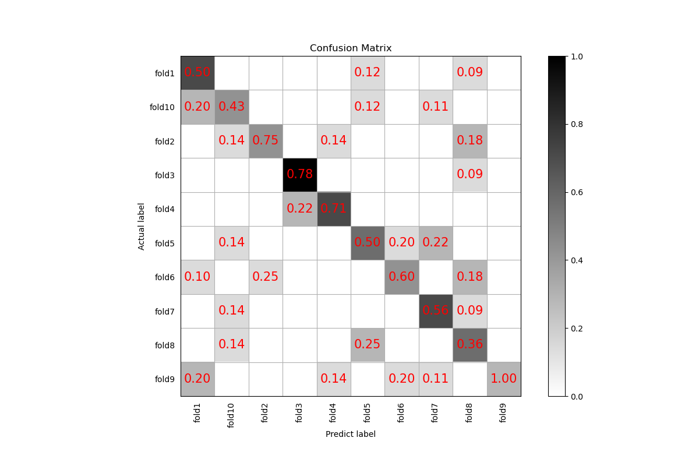

# 前言

本章我们来介绍如何使用Pytorch训练一个区分不同音频的分类模型，例如你有这样一个需求，需要根据不同的鸟叫声识别是什么种类的鸟，这时你就可以使用这个方法来实现你的需求了。


**欢迎大家扫码入QQ群讨论**，或者直接搜索QQ群号`1169600237`，问题答案为博主Github的ID`yeyupiaoling`。

<div align="center">
  
</div>


# 使用准备

 - Anaconda 3
 - Python 3.8
 - Pytorch 1.12.1
 - Windows 10 or Ubuntu 18.04

# 项目特性

1. 支持模型：EcapaTdnn、PANNS、TDNN、Res2Net、ResNetSE
2. 支持池化层：AttentiveStatsPool(ASP)、SelfAttentivePooling(SAP)、TemporalStatisticsPooling(TSP)、TemporalAveragePooling(
   TAP)
3. 支持预处理方法：MelSpectrogram、Spectrogram、MFCC


## 安装环境

 - 首先安装的是Pytorch的GPU版本，如果已经安装过了，请跳过。
```shell
conda install pytorch==1.12.1 torchvision==0.13.1 torchaudio==0.12.1 cudatoolkit=11.3 -c pytorch
```

 - 安装macls库。
 
使用pip安装，命令如下：
```shell
python -m pip install macls -U -i https://pypi.tuna.tsinghua.edu.cn/simple
```

**建议源码安装**，源码安装能保证使用最新代码。
```shell
git clone https://github.com/yeyupiaoling/AudioClassification_Pytorch.git
cd AudioClassification_Pytorch/
python setup.py install
```

## 数据数据

生成数据列表，用于下一步的读取需要，`audio_path`为音频文件路径，用户需要提前把音频数据集存放在`dataset/audio`目录下，每个文件夹存放一个类别的音频数据，每条音频数据长度在3秒以上，如 `dataset/audio/鸟叫声/······`。`audio`是数据列表存放的位置，生成的数据类别的格式为 `音频路径\t音频对应的类别标签`，音频路径和标签用制表符 `\t`分开。读者也可以根据自己存放数据的方式修改以下函数。

Urbansound8K 是目前应用较为广泛的用于自动城市环境声分类研究的公共数据集，包含10个分类：空调声、汽车鸣笛声、儿童玩耍声、狗叫声、钻孔声、引擎空转声、枪声、手提钻、警笛声和街道音乐声。数据集下载地址：[https://zenodo.org/record/1203745/files/UrbanSound8K.tar.gz](https://zenodo.org/record/1203745/files/UrbanSound8K.tar.gz)。以下是针对Urbansound8K生成数据列表的函数。如果读者想使用该数据集，请下载并解压到 `dataset`目录下，把生成数据列表代码改为以下代码。

执行`create_data.py`即可生成数据列表，里面提供了两种生成列表方式，第一种是自定义的数据，第二种是生成Urbansound8K的数据列表，具体看代码。
```shell
python create_data.py
```

生成的列表是长这样的，前面是音频的路径，后面是该音频对应的标签，从0开始，路径和标签之间用Tab隔开。
```shell
dataset/UrbanSound8K/audio/fold2/104817-4-0-2.wav	4
dataset/UrbanSound8K/audio/fold9/105029-7-2-5.wav	7
dataset/UrbanSound8K/audio/fold3/107228-5-0-0.wav	5
dataset/UrbanSound8K/audio/fold4/109711-3-2-4.wav	3
```

# 修改预处理方法

配置文件中默认使用的是MelSpectrogram预处理方法，如果要使用其他预处理方法，可以修改配置文件中的安装下面方式修改，具体的值可以根据自己情况修改。

1. `MelSpectrogram`预处理方法如下：

```yaml
preprocess_conf:
  # 音频预处理方法，支持：MelSpectrogram、Spectrogram、MFCC
  feature_method: 'MelSpectrogram'

# MelSpectrogram的参数，其他的预处理方法查看对应API设设置参数
feature_conf:
  sample_rate: 16000
  n_fft: 1024
  hop_length: 320
  win_length: 1024
  f_min: 50.0
  f_max: 14000.0
  n_mels: 64
```

1. `pectrogram'`预处理方法如下：

```yaml
preprocess_conf:
  # 音频预处理方法，支持：MelSpectrogram、Spectrogram、MFCC
  feature_method: 'Spectrogram'

# Spectrogram的参数，其他的预处理方法查看对应API设设置参数
feature_conf:
  n_fft: 1024
  hop_length: 320
  win_length: 1024
```

3. `MFCC`预处理方法如下：

```yaml
preprocess_conf:
  # 音频预处理方法，支持：MelSpectrogram、Spectrogram、MFCC
  feature_method: 'MFCC'

# MFCC的参数，其他的预处理方法查看对应API设设置参数
feature_conf:
  sample_rate: 16000
  n_fft: 1024
  hop_length: 320
  win_length: 1024
  f_min: 50.0
  f_max: 14000.0
  n_mels: 64
  n_mfcc: 40
```

## 训练

接着就可以开始训练模型了，创建 `train.py`。配置文件里面的参数一般不需要修改，但是这几个是需要根据自己实际的数据集进行调整的，首先最重要的就是分类大小`dataset_conf.num_class`，这个每个数据集的分类大小可能不一样，根据自己的实际情况设定。然后是`dataset_conf.batch_size`，如果是显存不够的话，可以减小这个参数。

```shell
# 单卡训练
CUDA_VISIBLE_DEVICES=0 python train.py
# 多卡训练
CUDA_VISIBLE_DEVICES=0,1 torchrun --standalone --nnodes=1 --nproc_per_node=2 train.py
```

# 评估
每轮训练结束可以执行评估，评估会出来输出准确率，还保存了混合矩阵图片，保存路径`output/images/`，如下。


# 预测

在训练结束之后，我们得到了一个模型参数文件，我们使用这个模型预测音频。

```shell
python infer.py --audio_path=dataset/UrbanSound8K/audio/fold5/156634-5-2-5.wav
```

# 其他功能

 - 为了方便读取录制数据和制作数据集，这里提供了录音程序`record_audio.py`，这个用于录制音频，录制的音频采样率为16000，单通道，16bit。

```shell
python record_audio.py
```

 - `infer_record.py`这个程序是用来不断进行录音识别，我们可以大致理解为这个程序在实时录音识别。通过这个应该我们可以做一些比较有趣的事情，比如把麦克风放在小鸟经常来的地方，通过实时录音识别，一旦识别到有鸟叫的声音，如果你的数据集足够强大，有每种鸟叫的声音数据集，这样你还能准确识别是那种鸟叫。如果识别到目标鸟类，就启动程序，例如拍照等等。

```shell
python infer_record.py --record_seconds=3
```
